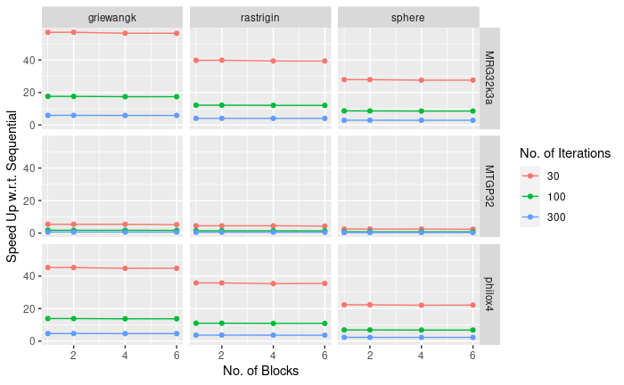

# Parallel Enhanced Whale Optimization Algorithm(Parallel WOAmM)

Parallel WOAmM is a GPU implementation of the WOAmM metaheuristic optimization algorithm in CUDA. I chose to go ahead with an embarrassingly parallel solution modeling individuals of the population as a CUDA thread. Hence I had to give up on some fraction of the data dependencies in the original sequential algorithm. Also, parallelizing a stochastic algorithm meant I had to be careful to ensure thread safety. The size of CPU random number generators (RNGs) is a constraint for the caches of GPU, and the GPU RNGs are of lower quality. To overcome the comparatively inefficient optimization with GPU RNGs, I tried the following approaches:

- Running multiple instances of Parallel WOAmM under CUDA blocks in parallel
- Increasing the number of iterations of Parallel WOAmM

The final experiment varied all combinations of the parameters given in the table to find the best combination of optimization and speedup.

| Function   | RNG            | # Blocks | # Iterations |
| ---------- | -------------- | -------- | ----------- |
| Sphere     | MTGP32         | 1        | 30          |
| Rosenbrock | MRG32k3a       | 2        | 100         |
| Rastrigin  | Philox_4x32_10 | 4        | 300         |
| Griewank   |                | 6        |             |

>Note: Each combination was run 50 times to achieve a sample size of 50, and all comparisons were between sequential WOAmM with a population size of 32 and 30 iterations.

## Parallelization Novelties

The main focus of the course was on parallelization, so I had to come up with novel ways to parallelize. They are as follows.

1. The population data and the fitness values were stored in the thread-local memory.
2. Fixing the population size of the Parallel WOAmM instance to that of the CUDA warp size, i.e., 32, allowed me to use the warp level primitives to share data between threads and altogether avoid the shared memory.
3. Butterfly reduction was used to find the individual with the best fitness.
4. Clever use of pointer array with conditionals for the index to avoid warp divergence.

## Results

We find that MRG32k3a GPU RNG with 100 iterations and four blocks of GPU threads o gives the best optimization and speedup.

## Future Work

1. Running multiple instances of Parallel WOAmM within a single block and syncing the best solution across all instances halfway through the optimization.
2. Replacing RNG with chaotic maps

## Acknowledgment

Parallel WOAmM is the end-term project I did for the [Parallel Programming](http://cds.iisc.ac.in/courses/ds-295-parallel-programming/) course instructed by [Sathish Vadhiyar](http://cds.iisc.ac.in/faculty/vss/). I am grateful for his guidance and support. I have used the GPU node of CDS Turing Cluster, with NVIDIA Tesla K40M GPU and Xeon E5 2620 V2 CPU with 24 GB memory for my experiments.

## References

- [WOAmM](https://www.sciencedirect.com/science/article/pii/S0360835220307567)
- [WOA](https://www.sciencedirect.com/science/article/pii/S0965997816300163)