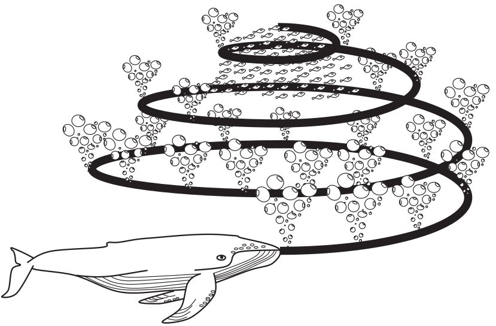
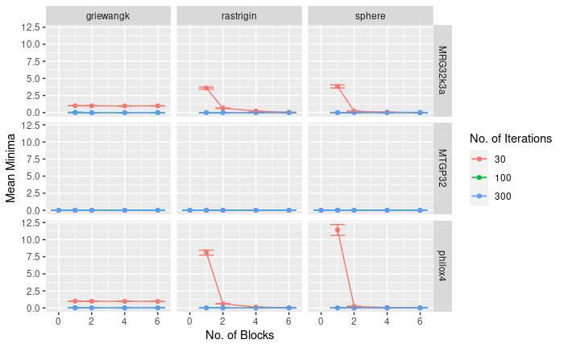
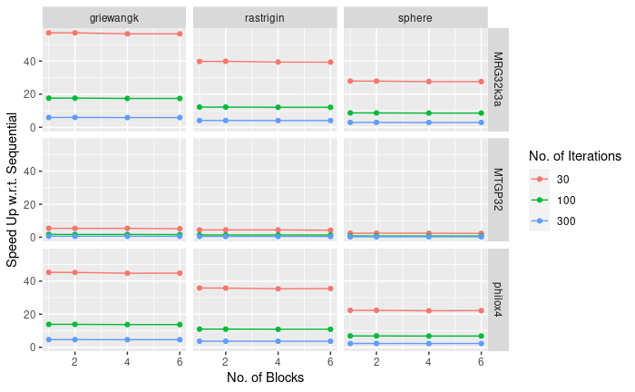

## Parallel Enhanced Whale Optimization Algorithm In CUDA

By Bevan Stanely https://bevs.xyz/

---

## Meta-Heuristic Optimization Algorithms

- Rely on simple concepts
- No need for gradient information
- Can bypass local optima
- Useful across wide range of problems

Note: Motivation

Popular in Engineering applications because-

Stochastic hence need random numbers

Exploratory and Exploitatory phases

---
<!-- .slide: data-background-image="./img/humbback.jpg" -->
## Whale Optimization Algorithm (WOA)<!-- .element: style="color:white;background-color: blue;" -->

- Iterative<!-- .element: style="color:white;background-color: black;"-->
- Swarm Based<!-- .element: style="color:white;background-color: black;"-->

Note: Inspired by the bubble-net feeding behavior of humpback whales

----

## Drawbacks

- Low exploration ability
- Slow convergence speed
- Sticking with local solution easily.

WOAmM<!-- .element: class="fragment"-->

Note:

Enhanced Whale Optimization Algorithm

Addresses these drawbacks

---

We want to develop a Parallel WOAmM with SpeedUPs in GPU

- Quality and size of RNGs<!-- .element: class="fragment"-->
- Data dependencies<!-- .element: class="fragment"-->

Note:

- GPU RNGs have lower quality host implementations are bulky and slow
- Sequential algorithms have data dependencies which aid in parallelization

---

## Enhanced Whale Optimization Algorithm (WOAmM)

Note:

Hybrid algorithm with

Two components

----

## mSOS

Modified Mutualism phase of the symbiotic organism search (mSOS) algorithm

$$
P^{(k+1)}_i= P^{(k)}_i+rnd\cdot(P_s - MV\cdot BF1)
$$

$$
P^{(k+1)}_r= P^{(k)}_n+rnd\cdot(P_s - MV\cdot BF2)
$$

<!-- .element: class="fragment"-->

Note:

- Pick two position vectors from other threads
- Pr = max() and Ps = min()
- BF = 1 or 2
- MV mean(pi,ps)

THis allows them to explore their local space

----

## WOA



Note:

- Randomly searching the prey
- Encircling the prey
- Bubble-net attacking strategy
  - Assume current best solution to be optimum and attack it

---

## How to Parallelise?

- Model individuals as GPU threads<!-- .element: class="fragment"-->
- Intra-warp Communication with Butterfly reduction<!-- .element: class="fragment"-->
- Avoiding Warp Divergence<!-- .element: class="fragment"-->
- Random Numbers<!-- .element: class="fragment"-->

```C
for(each thread in warp) do{
    while(k < max_iter){
        mSOS();
        WOA();
        k++;
    }
}
return best solution
```

Note:

We wanted to capitalize the warp level primitives, and hence fixed the population size to the warp size

Direct communication to communicate position vectors

Threads in a warp execute instructions in sync at every instant

We had 3 data dependent if else conditions

- Intra warp communication is faster than shared memory
- If else conditions have been avoided by using pointer arrays
- Random numbers: Device RNGs and Host RNG

---

## Experiment

| Parameters | Range                                  |
| ---------- | -------------------------------------- |
| RNG        | MTGP32,MRG32k3a,Philox_4x32_10         |
| Iterations | {30,100,300}                           |
| Blocks     | {1,2,4,6}                              |
| Functions  | {Sphere,Rosenbrock,Rastrigin,Griewank} |

Function Properties:

- Dimension = 30
- Optimum Value = 0

Note:

Sequential algorithm used Mersanne Twister 64 bit RNG

We have ignored the RNG initiation times for the experiments and focussed on computation times and memory copy costs.

It is hence suitable for bulk optimizations, so that reuse of state is possible.

---



Note:

The parallel implementation across all parameters was compared with sequential algorithm for their optimization quality.

Ive ignored rosenbrock because it did really bad for single block

The GPU RNGs did bad in single block and 30 iterations

Increasing block size had some effect upto 4 blocks

But increasing iterations were more effective

---



MRG32k3a with 100 iterations and 2 blocks appears to give best results<!-- .element: class="fragment"-->

Note:

The parallel implementation across all parameters was compared with sequential algorithm for their speedUp.

The speed up remains constant when increasing number of blocks

---

## Future Direction

- Search for better GPU RNGs
- Chaotic Maps instead of RNG

---

## ThanK U

https://bevs.xyz/
